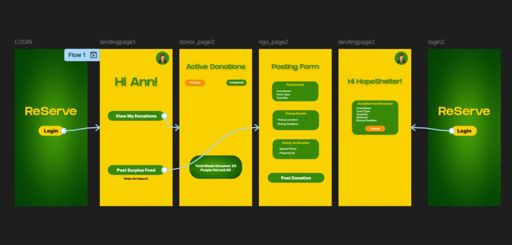

<p align="center">
  
</p>

# [ReServe] 🎯

## Basic Details

### Team Name: [Lumen]

### Team Members
- Member 1: [Ann Susan Jose] - [College Of Engineering Trivandrum]
- Member 2: [Ashmi Prakash] - [College Of Engineering Trivandrum]

### Hosted Project Link
[mention your project hosted link here]

### Project Description
[A smart mobile application that bridges the gap between excess food and those in need. By enabling instant donor-NGO coordination and real-time status tracking, it minimizes food waste while maximizing social impact.]

### The Problem statement
[Large quantities of edible food are wasted daily by restaurants, events, and households, while nearby communities and shelters struggle with food shortages. The lack of a real-time coordination system between food donors and NGOs leads to missed redistribution opportunities, increased landfill waste, and preventable hunger.]

### The Solution
[Large quantities of edible food are wasted daily by restaurants, events, and households, while nearby communities and shelters struggle with food shortages. The lack of a real-time coordination system between food donors and NGOs leads to missed redistribution opportunities, increased landfill waste, and preventable hunger.]

---

## Technical Details

### Technologies/Components Used

**For Software:**
- Languages used: [Dart]
- Frameworks used: [Flutter]
- Libraries used: [google_fonts,firebase_auth,cloud_firestore,firebase_core,flutterfile_cli]
- Tools used: [VS Code,Git]


## Features

List the key features of your project:
- Feature 1: [Donors can instantly post surplus food with quantity, location, and pickup deadline. Nearby NGOs receive real-time notifications, ensuring quick response and minimal spoilage.]
- Feature 2: [The system uses geolocation filtering to connect donors with NGOs within a defined service radius, enabling faster pickups and efficient distribution.]
- Feature 3: Each request moves through clear stages — Pending → Accepted → Completed. Both donors and NGOs can track updates in real time for transparency and accountability]
- Feature 4: [The platform tracks meals redistributed, food saved (kg), and estimated carbon emissions reduced, highlighting measurable social and environmental impact.]

---

## Implementation

### For Software:

#### Installation
```bash
[flutter pub get,flutter create foodConnectApp]
```

#### Run
```bash
[flutter run]
```

## Project Documentation

### For Software:

#### Screenshots (Add at least 3)


*Add caption explaining what this shows*


*Add caption explaining what this shows*


*Add caption explaining what this shows*


### For Mobile Apps:

#### App Flow Diagram


*Explain the user flow through your application*

#### Installation Guide

**For Android (APK):**
1. Download the APK from [Release Link]
2. Enable "Install from Unknown Sources" in your device settings:
   - Go to Settings > Security
   - Enable "Unknown Sources"
3. Open the downloaded APK file
4. Follow the installation prompts
5. Open the app and enjoy!


**Building from Source:**
```bash
# For Android
flutter build apk


#### Demo Output

**Example 1: Basic Processing**

**Input:**
```
This is a sample input file
with multiple lines of text
for demonstration purposes
```

**Command:**
```bash
python script.py sample.txt
```

**Output:**
```
Processing: sample.txt
Lines processed: 3
Characters counted: 86
Status: Success
Output saved to: output.txt
```

**Example 2: Advanced Usage**

**Input:**
```json
{
  "name": "test",
  "value": 123
}
```

**Command:**
```bash
python script.py -v --format json data.json
```

**Output:**
```
[VERBOSE] Loading configuration...
[VERBOSE] Parsing JSON input...
[VERBOSE] Processing data...
{
  "status": "success",
  "processed": true,
  "result": {
    "name": "test",
    "value": 123,
    "timestamp": "2024-02-07T10:30:00"
  }
}
[VERBOSE] Operation completed in 0.23s


## Team Contributions

- [Ashmi Prakash]: [Specific contributions - Frontend development, API integration]
- [Ann Susan Jose]: [Specific contributions -  Database design,Prototype Designing]

---

## License

This project is licensed under the [LICENSE_NAME] License - see the [LICENSE](LICENSE) file for details.

**Common License Options:**
- MIT License (Permissive, widely used)
- Apache 2.0 (Permissive with patent grant)
- GPL v3 (Copyleft, requires derivative works to be open source)

---

Made with ❤️ at TinkerHub